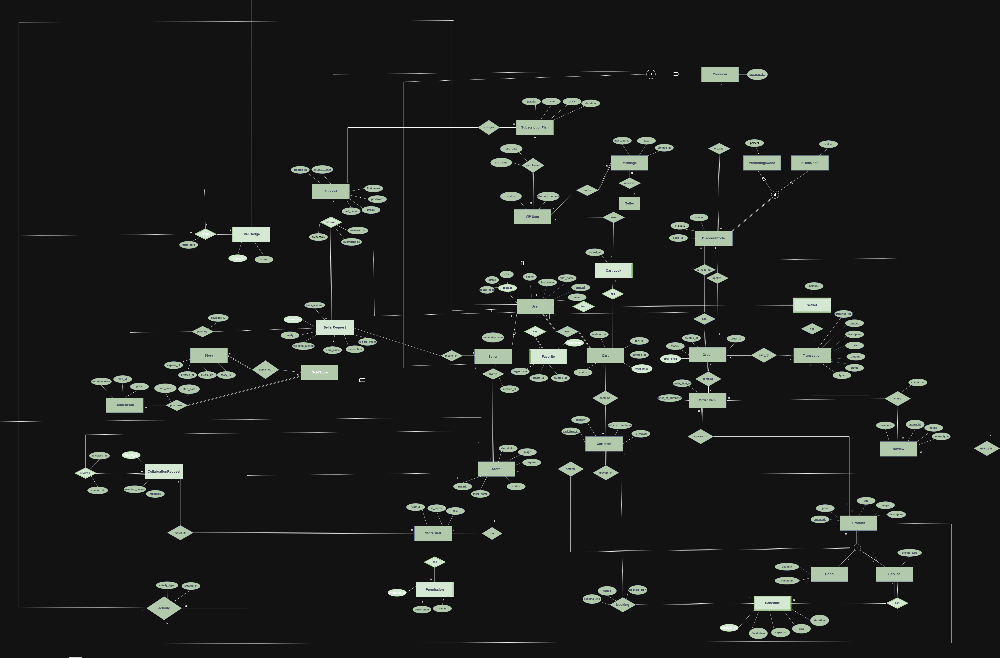

<h1 align="center">🛍️ Uni-Bazaar</h1>

<p align="center">
An Android marketplace application built with <b>Java</b> and <b>SQLite</b>, developed as a university Database course project.
</p>

<p align="center">
  
  
  
  
</p>

<p align="center">

<a href="apk/uni_bazaar.apk">

</a>

<a href="#demo">

</a>

<a href="#database-design">

</a>

</p>

---

<h1 id="demo">🎬 Demo</h1>

<p align="center">
  
</p>

---

# 📥 Download

Download the latest APK and try the application on your Android device.

> 📱 **[Download Uni-Bazaar APK](apk/uni_bazaar.apk)**

> **Note**
>
> This repository currently provides a **Debug APK** intended for demonstration and educational purposes.

---

# 📖 Overview

Uni-Bazaar is a local Android marketplace application that demonstrates the practical implementation of relational database concepts in an Android application.

The project was developed as part of a university **Database** course. The database was first designed using an **Enhanced Entity-Relationship (EER)** model and then implemented locally using **SQLite**.

The application manages users, support staff, stores, products, discount codes, purchase history, recommendations, and marketplace requests entirely on-device without relying on external servers.

---

# ✨ Features

## 👤 User Module

Users can:

- 🎟️ Manage discount codes
- 📝 Submit store requests
- 👀 View recently visited products
- 🔥 Explore best-selling products
- 🎯 Receive personalized recommendations
- 🏪 Access purchased stores
- 🚨 Identify fraudulent stores through dedicated scam badges

---

## 🛠️ Support Module

Support staff can:

- 📊 Monitor operational performance
- ✅ View verified store statistics
- 🎁 Generate discount codes
- 🏅 Give achievement badges
- 📈 Track performance using custom circular progress indicators

---

<h1 id="database-design">🗄️ Database Design</h1>

The application database was designed following a complete database development workflow:

- Enhanced Entity-Relationship (EER) Modeling
- Relational Database Design
- SQLite Implementation

The complete EER diagram is shown below.

<p align="center">
  
</p>

---

# 🧰 Tech Stack

- ☕ Java
- 📱 Android SDK
- 🗃️ SQLite
- 🛠️ Android Studio
- 🎨 Material Design Components
- 📊 Custom Views

---

# 📂 Project Structure

```text
app/
├── activities/
├── adapters/
├── database/
├── helpers/
├── models/
├── widgets/
└── res/

apk/
demo/
docs/
README.md
```

The project follows a modular architecture by separating UI components, database operations, models, adapters, and helper classes.

---

# 🚀 Future Improvements

- 🔐 User Authentication
- ☁️ Cloud Database Integration
- 🔄 Data Synchronization
- 🔍 Product Search & Filtering
- 🌙 Dark Mode
- 🔔 Push Notifications

---

# 🎓 Educational Purpose

This project was developed for educational purposes as part of a university Database course and focuses on combining database design principles with Android application development in a practical marketplace application.

---

<p align="center">
<b>⭐ If you found this project useful, consider giving it a star!</b>
</p>